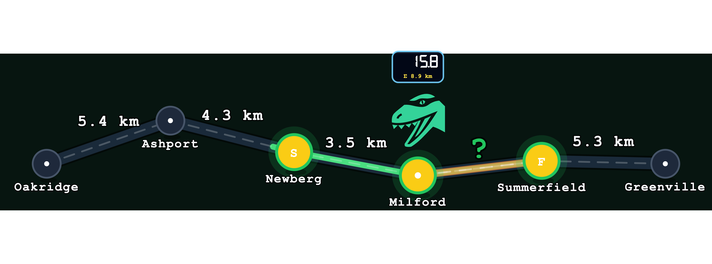

# Trail Distance Calculator

> An arcade-style maths game where learners drag a dinosaur along a trail map, watch an odometer accumulate distance, and solve decimal distance problems.

## What It Is

Trail Distance Calculator is a drag-based maths game built as a Progressive Web App. A dinosaur travels across a procedurally generated trail map connecting named towns, and the player answers questions about those journeys using the live odometer and the route itself.

The game moves from supported exploration to mental calculation:
- Level 1 focuses on total journey distance across multiple road segments.
- Level 2 focuses on missing-distance subtraction problems.
- Level 3 focuses on comparing two distances from a shared hub.

Each level ends with a Monster Round where the odometer is hidden, testing whether the learner can calculate without the visual scaffold.

## Objective

Read the route, travel it accurately, and calculate the required distance before submitting the answer. Collect enough eggs to unlock the Monster Round, then clear the Monster Round to complete the level.

## What It Teaches

| Level | Skill |
|---|---|
| **Level 1** | Adding decimal distances across multiple road segments |
| **Level 2** | Subtracting decimals to find a missing leg |
| **Level 3** | Comparing two distances from a shared hub |

## How to Play

1. Read the question and identify the towns involved.
2. Drag the dinosaur along the trail.
3. Watch the odometer and calculate the answer.
4. Enter your answer on the keypad and submit.
5. Collect enough eggs to unlock the Monster Round.
6. Clear the Monster Round (odometer hidden) to complete the level.

## Design Notes

- Decimal arithmetic stays grounded in a real-world trail-map context.
- Procedural generation keeps each run fresh, so learners calculate instead of memorising.
- The odometer supports guided exploration first, then the Monster Round removes it to test fluency.
- The arcade presentation and sound design keep repetition engaging without changing the maths goal.

## Specs

Full feature specifications are in [`specs/`](./specs/README.md).
The specs folder is the single source of truth for rebuilding or extending this game.

## Tech

- React 19
- TypeScript 5.9
- Vite 8
- Tailwind CSS v4
- SVG (trail map)
- Web Audio API (sound synthesis)
- jsPDF (session reports)
- Vercel (hosting + serverless)
- Playwright (automated testing)
